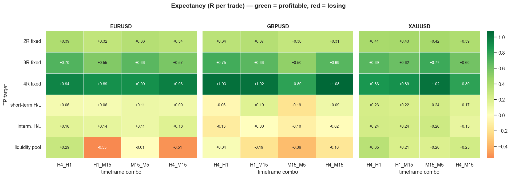

# MMC Decision Brain — neural trade-quality scoring

A neural decision layer that scores **whether a detected setup is worth taking**.
It sits on top of the two rule-based libraries in this repo and turns their
concepts into a single probability: *given everything the engines see at this
bar, how likely is this trade to hit target before stop?*

The brain does **not** find setups — the engines do that. Every candidate is a
**mitigated Fair Value Gap** (price tapped back into a gap). The brain's job is
the filter: take it, or skip it.

---

## Table of contents
- [The two knowledge bases](#the-two-knowledge-bases)
- [Architectures](#architectures)
- [The 55 features](#the-55-features)
- [How a trade is defined and labelled](#how-a-trade-is-defined-and-labelled)
- [Training methodology](#training-methodology)
- [The full experiment (72 models)](#the-full-experiment-72-models)
- [Results](#results)
- [Using the trained weights](#using-the-trained-weights)
- [File reference](#file-reference)
- [Reproducing](#reproducing)

---

## The two knowledge bases

The brain is fed features from **both** trading libraries in this repo, so it can
learn which library's concepts actually carry an edge:

| Source | Package | Origin | Features |
|--------|---------|--------|----------|
| **mmc** | [`mmc/`](../..) | Money Making Concepts, 12 videos | 31 |
| **atoz** | [`atoz/`](../../atoz) | ICT A-Z Guide, episodes 1–39 (faithful, transcript-by-transcript) | 24 |

**v1** = 31 mmc features. **v2** = 31 mmc + 24 atoz = **55 features**. v2 is the
current system; the concatenation is a controlled experiment — same setups, same
labels, only the feature columns differ — so the weights tell you exactly which
concepts matter.

---

## Architectures

Three models of increasing capacity (`architectures.py`):

| Model | Params | Idea |
|-------|--------|------|
| **Perceptron** | 56 | One weight per feature — directly readable concept importance |
| ShallowNN | ~1,900 | One hidden layer — learns simple concept *combinations* |
| DeepNN | ~6,400 | Deeper reasoning |

**The perceptron wins on this data and is the production model.** With ~14,000
training trades and only 56 parameters it cannot overfit; the deeper nets have
the *largest* seed-to-seed variance (the fingerprint of overfitting) and no
better test scores. The trading edge here is **linear** — concepts add up
(`fvg_quality` high AND `tier_protected` AND bias agrees), they don't need
layers of combination. Depth would only pay off with far more data.

---

## The 55 features

All features are computed at the entry bar with **no look-ahead** (HTF bias uses
only the most recent bias strictly before the entry bar's day).

**mmc (31)** — `features.py` `FEATURE_NAMES`: FVG/FVA quality & freshness, order
flow lag defenses (FLOD/ODD/LOD), sweeps vs runs, candle science, session/kill
zone timing, usual/unusual context, SMT, R-to-target, HTF bias & structure.

**atoz (24)** — `atoz_features.py` `ATOZ_FEATURE_NAMES`:

| Group | Features | Episode |
|-------|----------|---------|
| Killzone timing | `az_silver_bullet`, `az_london_setup`, `az_ny_setup`, `az_session_reversal` | 29–30, 33 |
| FVG story | `az_sweep`, `az_run`, `az_targets_opposing` | 24 |
| ST ("MSS is BS") | `az_st_present`, `az_st_dir_match` | 22–23 |
| Dealing range / DOL | `az_in_premium`, `az_in_discount`, `az_in_ote`, `az_dol_distance` | 20–21 |
| Market-maker / bias | `az_mmxm_bias`, `az_mmxm_bias_match`, `az_lag_strong` | 34, 36 |
| Turtle soup | `az_seek_destroy`, `az_strength_weakness`, `az_double_quadrant` | 28 |
| Structure secrets | `az_intermediate`, `az_tier_protected` | 32 |
| Consolidation / Judas / LP-HP | `az_consolidating`, `az_manipulation`, `az_hp_condition` | 27, 18–19, 26 |

Design: `AtozSignals.precompute()` runs every atoz detector **once** over the
whole timeframe, then per-bar lookups are cheap dict reads.

---

## How a trade is defined and labelled

For each mitigated FVG:

- **Entry** = the near edge of the gap; **Stop** = the far edge − a 0.1×ATR buffer.
- **Risk (1R)** = |entry − stop|.
- **Take-profit** depends on the *TP mode* (below).
- **Label** = forward-simulate bar by bar: `1` if TP is hit before SL, `0` if SL
  first, dropped if neither within 200 bars. Wicks count (intrabar); if both are
  touched on one bar we assume the loss (conservative).

### Take-profit modes tested

| Mode | Target |
|------|--------|
| `rr2` / `rr3` / `rr4` | Fixed 2R / 3R / 4R |
| `sth` | Nearest short-term high (bullish) / low (bearish) — swing + FVG |
| `ith` | Nearest intermediate-term high/low |
| `liq` | Nearest **buy-side** liquidity pool above (bullish) / **sell-side** below (bearish) |

Structural targets are clamped to a realistic `[0.5R, 10R]`.

---

## Training methodology

- **Split:** chronological **70 / 15 / 15** (train / validation / test) with a
  10-bar embargo gap between splits — no shuffling, so the test set is always a
  *later* period than training (honest walk-forward).
- **Loss:** class-weighted `BCEWithLogitsLoss` (setups are ~50/50 but TP-mode
  dependent), Adam, `ReduceLROnPlateau`, early stopping on validation loss.
- **Seeds:** each model trained across **5 seeds**; the best test-expectancy seed
  is kept. Multi-seed is essential — a single split can look ±3pp lucky.
- **The metric that matters is expectancy**, not win rate:

  ```
  expR  =  WR × avgRR  −  (1 − WR) × 1R      (R per trade)
  ```

  A 38%-win 4R model (expR ≈ +0.9R) beats a 46%-win 2R model (expR ≈ +0.4R).

---

## The full experiment (72 models)

```
3 pairs  ×  4 timeframe combos  ×  6 take-profit modes  =  72 models
```

- **Pairs:** EURUSD, GBPUSD, XAUUSD
- **Timeframe combos** (higher-TF bias → entry TF): `H4→H1`, `H1→M15`,
  `M15→M5`, `H4→M15`
- **Data:** full **100,000 bars** per entry timeframe (EURUSD H1 = 2010–2026).
- **Efficiency:** the 55-feature dataset is built **once per (pair, combo)** and
  cheaply relabelled for all 6 TP modes — 12 heavy builds, not 72.

Runner: [`examples/train_all.py`](../../examples/train_all.py) — checkpointed &
resumable via `weights/_manifest.json`, runs perceptron ×5 seeds per job.

---

## Results

**Every one of the top 10 models is a fixed 4R target.**

| # | Pair | Combo | TP | exp R/trade | WR | PF |
|---|------|-------|-----|-------------|-----|-----|
| 1 | GBPUSD | H4→M15 | 4R | **+1.079** | 41.6% | 2.85 |
| 2 | GBPUSD | H4→H1 | 4R | +1.035 | 40.7% | 2.75 |
| 3 | GBPUSD | H1→M15 | 4R | +1.024 | 40.5% | 2.72 |
| 4 | XAUUSD | M15→M5 | 4R | +1.016 | 40.3% | 2.70 |
| 5 | EURUSD | H4→M15 | 4R | +0.965 | 39.3% | 2.59 |
| 6 | EURUSD | H4→H1 | 4R | +0.944 | 38.9% | 2.54 |
| 7 | EURUSD | M15→M5 | 4R | +0.898 | 38.0% | 2.45 |
| 8 | EURUSD | H1→M15 | 4R | +0.889 | 37.8% | 2.43 |
| 9 | XAUUSD | H1→M15 | 4R | +0.885 | 37.7% | 2.42 |
| 10 | XAUUSD | H4→H1 | 4R | +0.862 | 37.2% | 2.37 |

### Take-profit ranking (averaged over all pairs & timeframes)

| Target | avg expR | worst | best |
|--------|----------|-------|------|
| **4R fixed** | **+0.933** | +0.799 | +1.079 |
| 3R fixed | +0.649 | +0.496 | +0.766 |
| 2R fixed | +0.365 | +0.303 | +0.427 |
| intermediate H/L | +0.102 | −0.126 | +0.264 |
| short-term H/L | +0.100 | −0.188 | +0.241 |
| liquidity pool | −0.037 | −0.550 | +0.349 |

### Findings

1. **Fixed 4R wins on every pair and timeframe** — the clearest result in the
   matrix. Higher RR wins despite lower win rate because expectancy compounds.
2. **The take-profit rule matters more than the timeframe.** All four combos land
   near +0.9R at 4R; `H4→M15` (swing bias + precise M15 entry) is marginally best.
3. **Structural (STH/ITH) and liquidity targets underperform** — they cap reward
   too early. Liquidity targeting is negative on EUR/GBP M15 entries.
4. **XAUUSD is the most forgiving** — the only pair where structural/liquidity
   targets stay positive everywhere (Gold trends cleanly).
5. **`az_tier_protected` (atoz, ep 32) is the #1 concept weight for all three
   pairs' best models** — protected intermediate highs/lows beat even
   `fvg_quality`. Strong endorsement of the atoz library.

Full detail in [`weights/RESULTS_REPORT.txt`](weights/RESULTS_REPORT.txt),
[`weights/RESULTS_TABLE.csv`](weights/RESULTS_TABLE.csv), and the charts in
[`weights/charts/`](weights/charts/) (generated by
[`examples/results_visualization.py`](../../examples/results_visualization.py)).



---

## Using the trained weights

Each job saves two files in `weights/`:
`<PAIR>_<COMBO>_<MODE>.json` (readable weights + metrics) and `.pt` (PyTorch
state for inference).

**Read the concept weights:**

```python
import json
w = json.load(open("mmc/brain/weights/GBPUSD_H4_M15_rr4.json"))
print(w["win_rate"], w["exp_r_per_trade"], w["real_pf"])
for name, wt in list(w["weight_map"].items())[:10]:
    print(f"{name:24} {wt:+.3f}")
```

**Score a live setup** (load the perceptron, feed the 55-feature vector):

```python
import torch, json
from mmc.brain.architectures import get_model
from mmc.brain.features_v2 import FEATURE_NAMES_V2, extract_features_v2

model = get_model("perceptron", n_features=55)
model.load_state_dict(torch.load("mmc/brain/weights/GBPUSD_H4_M15_rr4.pt"))
model.eval()

# feats = extract_features_v2(bar_idx, entry_df, atoz_signals, htf_df, corr_df, direction)
x = torch.tensor(feats, dtype=torch.float32).unsqueeze(0)
prob = torch.sigmoid(model(x)).item()      # take the trade if prob >= 0.50
```

Raising the threshold above 0.50 trades fewer, higher-quality setups (WR and PF
climb; frequency falls).

---

## File reference

| File | Purpose |
|------|---------|
| `architectures.py` | Perceptron / ShallowNN / DeepNN |
| `features.py` | 31 mmc features (`extract_features`) |
| `atoz_features.py` | 24 atoz features + `AtozSignals.precompute` |
| `features_v2.py` | Concatenated 55-feature vector |
| `labels.py` | Forward-simulation win/loss labelling |
| `dataset.py` / `dataset_v2.py` | Build feature+label tables (v1 / v2) |
| `batch.py` | Build-once-relabel-many for TP-mode sweeps |
| `train.py` / `train_v2.py` | Walk-forward training, splits, evaluation |
| `weights/` | Trained `.json` + `.pt`, report, CSV, charts |

Runners in [`examples/`](../../examples): `run_brain.py`, `run_brain_v2.py`,
`train_weights.py`, `train_weights_2r.py`, `train_all.py`,
`results_visualization.py`.

---

## Reproducing

```bash
# full 72-model matrix (checkpointed & resumable; ~2.5–3.5h on a 2-core CPU)
python examples/train_all.py

# regenerate the report + charts from the saved weights
python examples/results_visualization.py

# quick single run (EURUSD H4->H1, all 3 architectures, v2 features)
python examples/run_brain_v2.py --symbol EURUSD --limit 10000
```

> **Caveat — backtest, not live.** Test scores are on held-out historical data
> with no spread, slippage, or commission, and forex regimes drift. Treat the
> numbers as an upper bound and paper-trade before risking capital.
