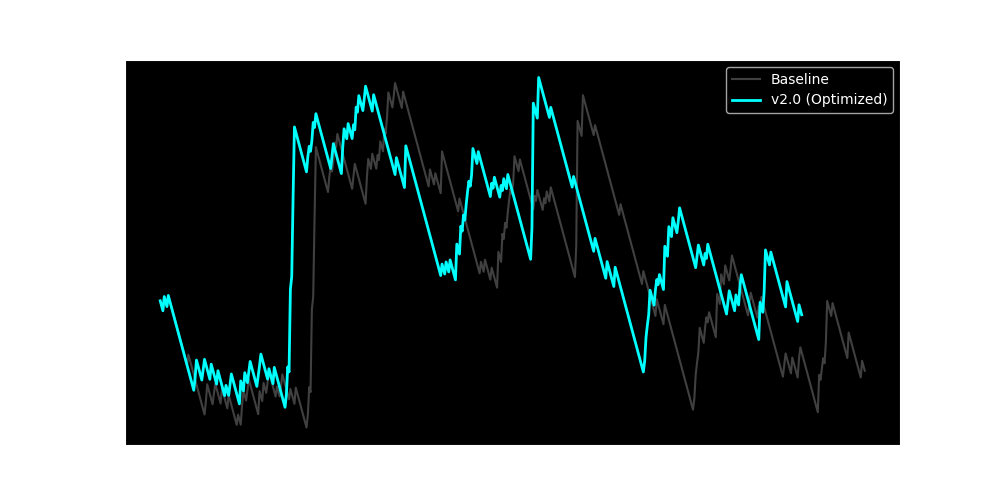
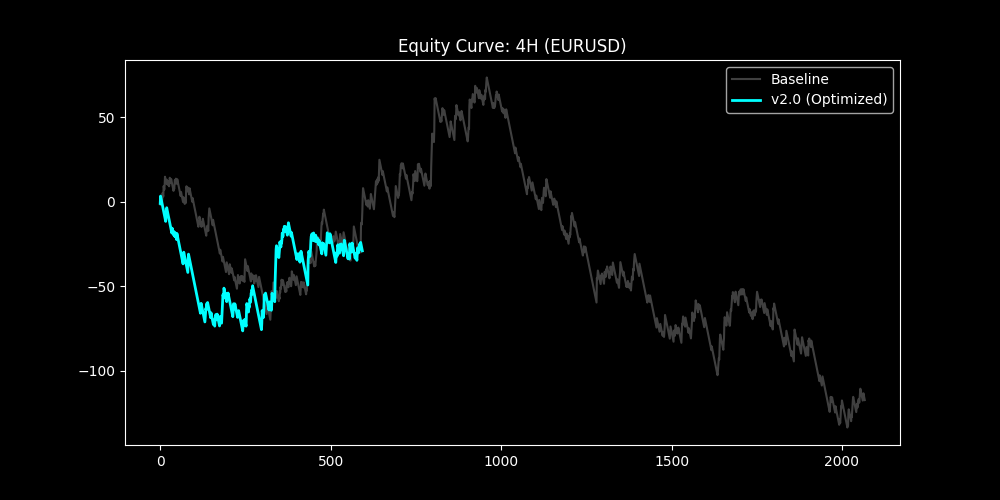
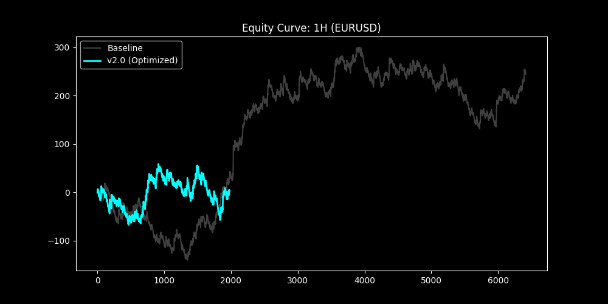
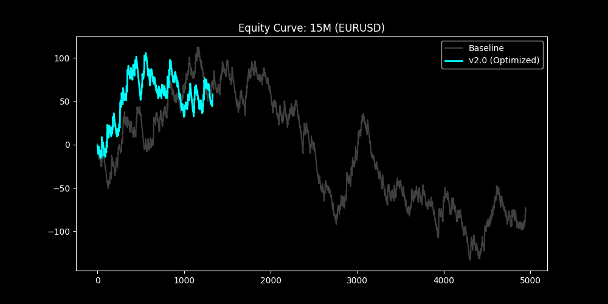
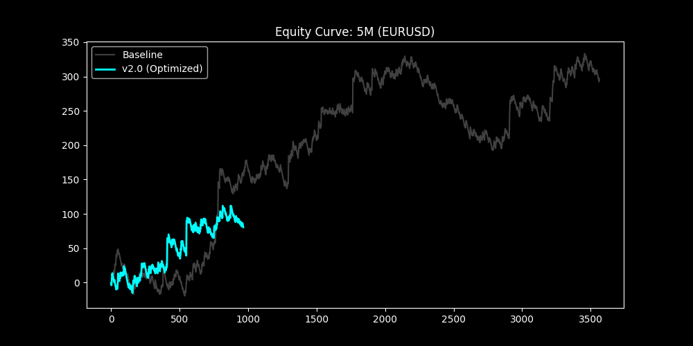

## Strategy 1 v2.0: Multi-Timeframe Institutional Analysis
**Generated on**: Thu Apr 23 04:11:05 2026

| TF    | Signals      | WinRate          | TotalRR             | ProfitFactor   | MaxDD              | Sharpe         |
|:------|:-------------|:-----------------|:--------------------|:---------------|:-------------------|:---------------|
| DAILY | 526 -> 479   | 20.15% -> 20.25% | +-15.03 -> +-3.80   | 0.96 -> 0.99   | 65.97R -> 59.03R   | -0.19 -> -0.05 |
| 4H    | 2068 -> 594  | 20.94% -> 20.71% | +-117.40 -> +-29.06 | 0.93 -> 0.94   | 207.22R -> 79.82R  | -0.44 -> -0.38 |
| 1H    | 6416 -> 1978 | 23.33% -> 20.42% | +244.37 -> +2.21    | 1.05 -> 1.00   | 168.64R -> 115.86R | 0.29 -> 0.01   |
| 15M   | 4947 -> 1331 | 23.43% -> 21.71% | +-76.92 -> +57.29   | 0.98 -> 1.05   | 245.85R -> 73.92R  | -0.13 -> 0.31  |
| 5M    | 3564 -> 966  | 25.59% -> 23.40% | +296.95 -> +80.55   | 1.11 -> 1.11   | 136.81R -> 38.72R  | 0.62 -> 0.56   |

### Timeframe Equity Curves
#### DAILY Performance

#### 4H Performance

#### 1H Performance

#### 15M Performance

#### 5M Performance

